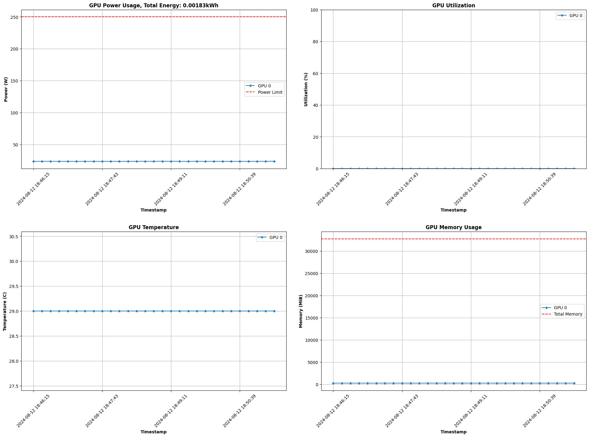

### Carbon Metrics Accuracy Limitations
* The Carbon Data is collected in real-time from the [National Grid ESO Regional Carbon Intensity API.](https://api.carbonintensity.org.uk)
* The Carbon Forecast Readings are updated every 30 minutes. The monitor records the index values at the start and end of each interval and calculates an average. Therefore, the accuracy may be limited for containers that run longer than 30 minutes, as the index can fluctuate significantly over time.
* The Carbon Forecast can vary based on factors such as weather, time of day/year, and energy demand, resulting in fluctuations in total carbon emissions from one run to the next. Therefore, it serves as a real-time estimate. For a broader perspective, you can multiply the total energy by the average Carbon Emission Rate in the UK, which was [162 gCO2/kWh in 2023.](https://www.carbonbrief.org/analysis-uk-electricity-from-fossil-fuels-drops-to-lowest-level-since-1957/#:~:text=Low%2Dcarbon%20sources%20made%20up,fully%20decarbonised%20grid%20by%202035.)
* For more on [**Enhancing Carbon Footprint Accuracy for GPU Workloads**]() please go to Future Work section.
### GPU Metrics Accuracy Limitions
* The GPU metrics come from pynvml which is a python interface for NVML and "nvidia-smi" results.
* The ["error in nvidia-smi's power draw is ± 5%".](https://arxiv.org/html/2312.02741v2#:~:text=The%20error%20in%20nvidia%2Dsmi's,%C2%B1%2030W%20of%20over%2Funderestimation.>)
* Total energy is calculated by integrating power readings over time using the trapezoidal integration method. The accuracy of this calculation depends on the monitoring interval: a smaller interval results in more accurate energy estimates.

### Profiling the Monitors Impact on GPU Resources
* (Minimal) GPU Resource Usage by the Monitor: The monitoring tool consumes a small portion of GPU resources. For instance, a ~5-minute test done on a VM with a V100 GPU and the [dummy benchmark container](building_docker_images.md#dummy-benchmark-container) shows negligible GPU usage, see below. CPU resources are also utilized, though profiling tests to determine exact CPU usage have not yet been conducted.

```sh
GPU and Carbon Performance Results

+---------------------------------------+---------+
| Metric                                | Value   |
+=======================================+=========+
| Benchmark Image Name                  | dummy   |
+---------------------------------------+---------+
| Elapsed Monitor Time of Container (s) | 320.177 |
+---------------------------------------+---------+
| Total GPU Energy Consumed (kWh)       | 0.00183 |
+---------------------------------------+---------+
| Total GPU Carbon Emissions (gCO2)     | 0.36118 |
+---------------------------------------+---------+
```

  

* These are idle usage levels, so monitoring the GPUs has a negligible impact on GPU resources.

---

[Previous Page](live_monitoring.md) | [Next Page](work_to_do.md)
